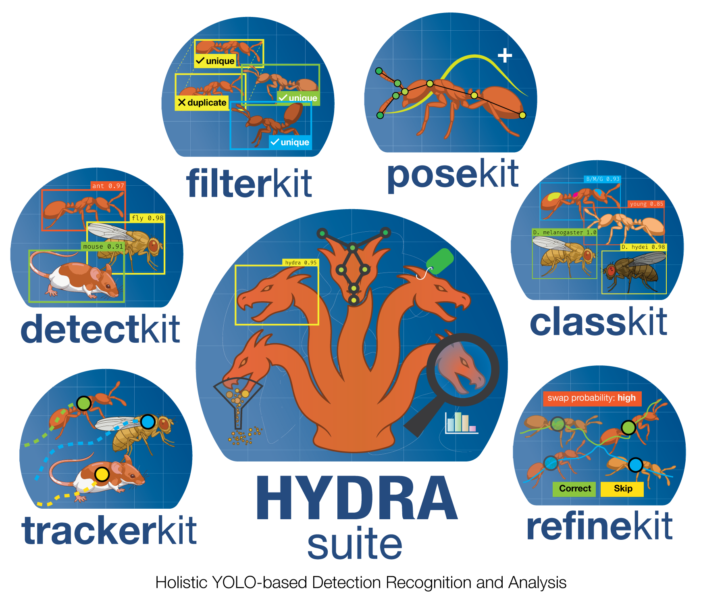

# Multi-Animal-Tracker Documentation



Welcome to the central documentation for:

- `multianimaltracker`/ `mat` (tracking GUI)
- `posekit-labeler` / `pose` (pose labeling GUI)

!!! info "Use This Site as the Source of Truth"
    This docs site is the canonical guide for setup, workflows, feature behavior, and reference material.

## Quick Navigation

<div class="grid cards" markdown>

- :material-rocket-launch: **Getting Started**

    ---

    Installation, first launch, and platform setup.

    [Open Getting Started](getting-started/installation.md)

- :material-play-circle: **User Guide**

    ---

    End-to-end workflow for tracking, post-processing, datasets, and identity analysis.

    [Open User Guide](user-guide/overview.md)

- :material-source-branch: **Developer Guide**

    ---

    Architecture, module map, data flow, extension points, and performance notes.

    [Open Developer Guide](developer-guide/architecture.md)

- :material-book-open-page-variant: **Reference**

    ---

    API docs, CLI docs, UI component references, FAQ, and changelog.

    [Open Reference](reference/api-index.md)

</div>

## Launch Commands

```bash
# Tracking GUI
mat
# or
multianimaltracker

# Pose labeling GUI
posekit-labeler
# or
pkl
```

## Local Docs Workflow

=== "Serve locally"

    ```bash
    make docs-install
    make docs-serve
    ```

=== "Strict build"

    ```bash
    make docs-build
    make docs-check
    ```

## Scope

This documentation maps to the current package layout:

- `multi_tracker.app`
- `multi_tracker.core`
- `multi_tracker.data`
- `multi_tracker.gui`
- `multi_tracker.posekit`
- `multi_tracker.utils`

Legacy flat docs are archived under `docs/archive/legacy-flat/`.
