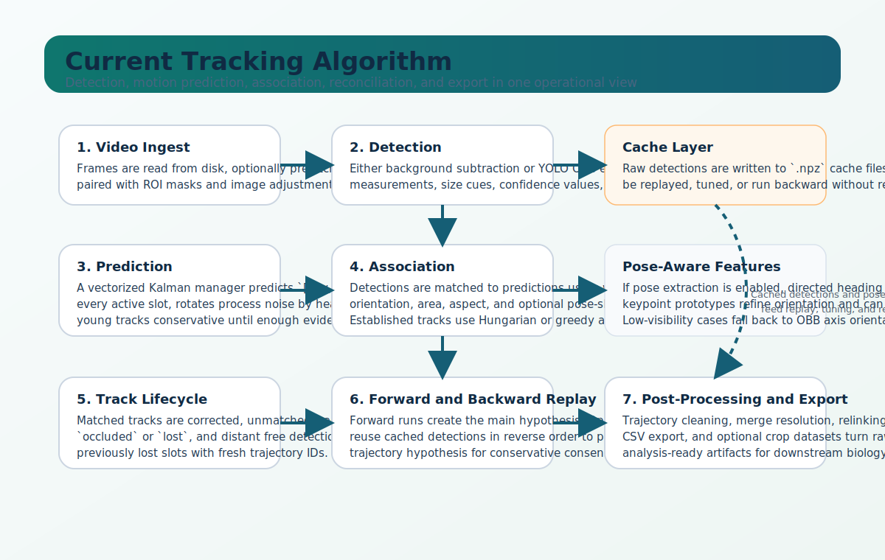
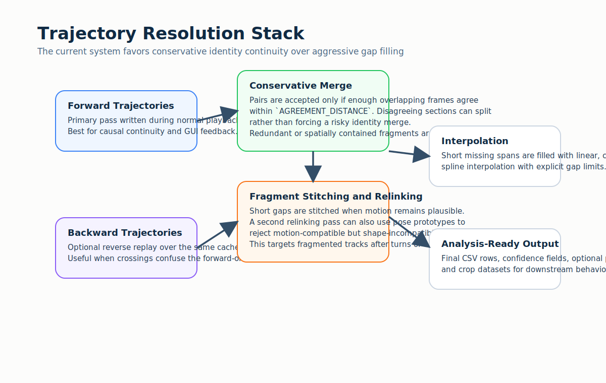
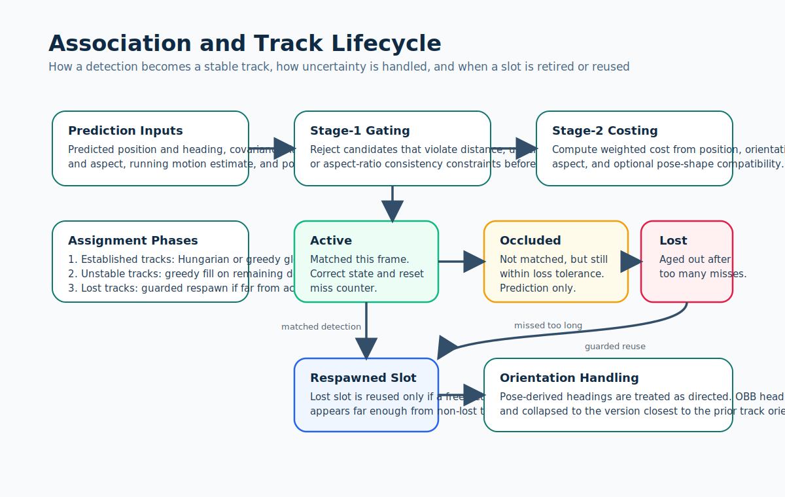

# Tracking, Identity Continuity, and Merging

This page explains how the current Multi-Animal-Tracker pipeline turns raw video into stable trajectories.

It is written in two layers:

- The first sections explain the system in plain language.
- The later sections describe the implemented decision logic closely enough to tune runs and interpret failure modes.



## Plain-English Overview

At a high level, the tracker repeats the same question on every frame:

1. Where are the animals now?
2. Which current detections belong to which existing tracks?
3. Which tracks should stay alive, go temporarily missing, or be declared lost?
4. After the full run, which trajectory segments are trustworthy enough to keep, merge, relink, or interpolate?

The system is intentionally conservative in the places where identity mistakes are expensive:

- It predicts where each animal should be before it looks at the new frame.
- It does not match every detection to every track equally. It first gates out implausible candidates.
- It treats forward and backward passes as separate hypotheses rather than assuming either one is always correct.
- In post-processing, it prefers splitting uncertain segments over forcing a single, smooth-but-wrong trajectory.

## What Happens on Every Frame

### 1. Video ingest and preprocessing

The worker reads frames from the selected video range and can prefetch frames asynchronously when that improves throughput. Depending on the mode, it may also:

- resize the frame for processing,
- apply ROI masking,
- stabilize lighting for background subtraction,
- or skip frame reads entirely when cached detections are sufficient and no visualization is needed.

### 2. Detection

The current tracker supports two major detection paths.

#### Background subtraction

This mode builds and updates a background model, subtracts the current frame, cleans the foreground mask, and extracts measurement candidates from connected components.

This is most useful when:

- the scene is controlled,
- the background is stable,
- the target count is moderate,
- and you want a lightweight pipeline without a learned detector.

#### YOLO OBB

This mode runs oriented object detection and keeps richer per-detection geometry:

- center position,
- orientation,
- oriented bounding box corners,
- area,
- aspect ratio,
- confidence,
- and a persistent `DetectionID`.

When caching is enabled, YOLO can run as a two-phase pipeline:

1. First pass: batch inference writes raw detections to the detection cache.
2. Second pass: tracking, visualization, pose extraction, and export reuse those cached detections.

That design matters because it separates expensive inference from the rest of the tracking workflow and makes reruns reproducible.

### 3. Motion prediction

Each track slot has a small motion model. Before matching detections, the tracker predicts where the animal should be next using a vectorized Kalman filter.

The state includes:

```text
[x, y, theta, vx, vy]
```

This lets the tracker carry forward:

- current position,
- current body orientation,
- and short-term motion direction.

The filter is not generic boilerplate. The current implementation is tuned for animal motion:

- process noise is anisotropic and rotated into the animal's heading frame,
- velocity is damped so stopped animals do not overshoot badly,
- very young tracks keep velocity conservative until they mature,
- and a maximum velocity constraint prevents unrealistic jumps.

### 4. Association

Once predictions exist, the tracker compares them against the detections in the current frame.

The comparison is based on a weighted cost made from:

- positional disagreement,
- orientation disagreement,
- area mismatch,
- aspect-ratio mismatch,
- and, when enabled, pose-shape disagreement.

The important point is that matching is not only "closest centroid wins". The tracker uses multiple cues because crowded animal videos frequently produce cases where position alone is ambiguous.

### 5. Track lifecycle management

After assignment, each track slot is updated into one of three practical states:

- `active`: the slot matched a detection this frame,
- `occluded`: the slot missed this frame but has not exceeded the loss threshold,
- `lost`: the slot has missed too long and is no longer trusted as a live trajectory.

Lost slots are not immediately discarded forever. They can be reused, but only when a new free detection appears far enough from all non-lost tracks to avoid creating a duplicate near an already-active animal.

### 6. Forward and backward hypotheses

If backward tracking is enabled, the system runs a second pass over the cached detections in reverse temporal order.

Why do this?

- Crossings and brief occlusions often look different when viewed backward.
- A forward-only answer can be locally plausible but globally inconsistent.
- Comparing forward and backward hypotheses gives the post-processing stage a second opinion before it commits to a final merged trajectory set.

### 7. Post-processing

Post-processing turns raw trajectories into analysis-ready outputs. The current stack can:

- remove short fragments,
- split trajectories at implausible jumps,
- split at long occlusion runs,
- conservatively merge forward and backward tracks,
- stitch nearby fragments across short gaps,
- relink fragments using motion and optional pose continuity,
- and interpolate short missing spans.



## The Current Tracking Logic in Detail

### Measurement representation

A detection contributes several parallel data streams:

- measurement: center and orientation,
- size: detector-specific scale information,
- shape: area and aspect ratio,
- confidence,
- OBB corners when available,
- and `DetectionID`.

For YOLO OBB mode, detections can also be paired with pose features if the individual-properties cache exists.

### Orientation handling

Orientation is one of the subtle parts of the current implementation.

#### OBB orientation is often axis-aligned, not directed

For many oriented boxes, angle `theta` and `theta + pi` describe the same body axis. The tracker resolves that ambiguity by choosing the version that is closest to the previous track orientation.

That prevents avoidable 180-degree flips.

#### Pose can override orientation

If pose extraction is enabled and the configured anterior and posterior keypoint groups are visible enough, the tracker computes a directed heading from posterior to anterior. In that case:

- orientation becomes genuinely directed,
- assignment can use that heading,
- and track updates use the pose-derived angle instead of the ambiguous OBB axis.

If pose visibility is too poor, the system falls back to the OBB-based orientation logic.

### Cost gating before global assignment

The tracker does not always evaluate every detection-track pair equally.

Before full association, it can reject candidate pairs that violate a coarse feasibility envelope. The current gate uses:

- motion-scaled distance,
- track uncertainty,
- area-ratio consistency,
- and aspect-ratio consistency.

That reduces bad candidate pairs and also improves performance when the number of animals grows.

### Assignment phases

The assignment step is intentionally staged rather than monolithic.



#### Phase 1: established tracks

Tracks whose continuity is above the configured threshold are treated as established. These are the most trusted tracks and get first access to detections.

Depending on configuration, the tracker uses:

- Hungarian assignment for a more global optimum, or
- greedy assignment for better throughput.

#### Phase 2: unstable tracks

Low-continuity but not-yet-lost tracks are filled greedily from the remaining detections, in descending order of continuity.

This gives partially stabilized tracks a chance to recover without letting them dominate the assignment.

#### Phase 3: lost-track respawn

Remaining detections can be used to revive lost slots, but only if they are sufficiently far from currently non-lost predictions. This protects against the common failure mode where a second track is spawned on top of an already-tracked animal.

### Track update behavior

When a match is accepted:

- the Kalman filter is corrected,
- continuity increases,
- missed-frame count resets,
- speed is estimated from the recent position deque,
- orientation is smoothed,
- shape history is updated,
- and pose prototypes are updated with an exponential moving average.

The pose prototype update matters because it lets the tracker maintain a running normalized body-shape memory for later association and relinking.

## How Forward and Backward Results Are Merged

The merge strategy is deliberately conservative.

Two trajectory fragments become merge candidates only if they share enough overlapping frames where their positions agree within `AGREEMENT_DISTANCE`.

That means the merge stage asks:

- "Do these trajectories tell the same story where they overlap?"

not:

- "Can I invent a single continuous track from these two fragments?"

The consequences are important:

- good identity continuity is prioritized over cosmetic smoothness,
- disagreeing regions can split instead of forcing a merge,
- and the final output may contain more fragments than a more aggressive smoother, but those fragments are usually more defensible.

After the main merge, the system also performs:

- redundancy removal for trajectories spatially contained inside others,
- overlap-aware merging of agreeing fragments,
- and short-gap stitching.

## Post-Processing Stages

### Fragment cleanup

Short segments below `MIN_TRAJECTORY_LENGTH` are removed early because they often represent unstable detector noise or incomplete identity handoffs.

### Velocity-based breaking

The tracker can split a trajectory when velocity becomes implausibly large. This is useful for identity-swap events that pass through the online assignment stage but later look physically impossible.

### Velocity z-score breaking

An optional z-score-based breaker looks for sudden, statistically abnormal motion changes relative to the recent history of that trajectory. This is aimed at swap-like discontinuities that are not caught by a single fixed absolute velocity threshold.

### Occlusion-gap splitting

Long runs of `occluded` state can be used as break points. This avoids pretending that a track stayed reliable through a prolonged missing interval.

### Motion-and-pose relinking

After conservative splitting, the current implementation can greedily reconnect fragments when:

- the temporal gap is short enough,
- motion extrapolation stays plausible,
- heading remains compatible when motion is informative,
- and pose prototypes do not contradict the join.

This is particularly useful for turn maneuvers, temporary detector dropouts, and short occlusions in which the online tracker became too cautious.

### Interpolation

Interpolation is the last polish step, not the main identity mechanism.

It fills short missing spans only up to the configured maximum gap and supports:

- `linear`,
- `cubic`,
- `spline`,
- or no interpolation.

For orientation, the tracker uses circular interpolation logic rather than plain numeric interpolation.

## Practical Tuning Order

If a run is poor, this order usually converges faster than random parameter search:

1. Fix detection quality first.
2. Reconfirm `REFERENCE_BODY_SIZE`.
3. Tune assignment distance and lifecycle thresholds.
4. Only then adjust Kalman and post-processing parameters.
5. Enable backward tracking and relinking after the forward-only baseline is already reasonable.

### If animals are merging into one blob

- Improve detection quality before widening assignment gates.
- Tighten size and shape filtering.
- Revisit ROI and lighting stabilization.

### If tracks fragment too often

- Increase the lost threshold modestly.
- Relax assignment distance only enough to recover consistent misses.
- Check whether pose extraction is helping or vetoing too aggressively.

### If IDs swap during crossings

- Enable backward tracking.
- Keep merging conservative.
- Use pose direction and pose rejection if pose estimates are reliable.

### If the run is too slow

- Use cached detections.
- Use visualization-free mode when possible.
- Turn on batched YOLO inference.
- Use spatial optimization for larger target counts.

## Recommended Reading Paths

- For a code-oriented explanation, continue to [Tracking Algorithm Deep Dive](../developer-guide/tracking-algorithm-deep-dive.md).
- For the formal reference manuscript source, see [Technical Reference (LaTeX)](../reference/technical-reference.md).
